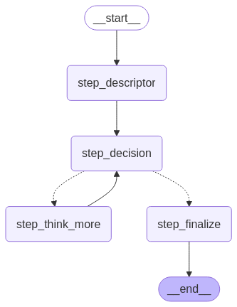

# AI Agent Demo

This project demonstrates a cyclic "thinking" AI agent built using FastAPI, LangGraph, and LangChain's ChatOpenAI model (`gpt-4o-mini`). The agent fetches and sanitizes website content, generates a concise description, iteratively “thinks” to gather additional insights, and then provides a final multi-line business evaluation along with a rating.

---

## 🔁 Agent Architecture

Below is a high-level diagram of how the cyclic agent works, visualized using LangGraph:



---

## 🧠 How the Agent Works

1. **Fetch & Sanitize Website Content**  
   The agent retrieves raw HTML and extracts readable text using BeautifulSoup.

2. **Generate Descriptor**  
   It creates a one-line summary of the site's content using `ChatOpenAI`.

3. **Decision Cycle**  
   The agent loops:

   - Decides if it has enough info
   - If not, thinks more and gathers insights
   - Updates its internal thoughts and trends
   - Loops again (max 3 iterations)

4. **Final Evaluation**  
   Once confident, the agent outputs:
   - A final summary (3–5 lines)
   - A business viability rating (1–10)

---

## 🗂️ Project Structure

```
ai-agent-demo/
├── main.py            # Contains FastAPI endpoints and the cyclic LangGraph agent.
├── requirements.txt   # Lists project dependencies.
├── README.md          # This file.
├── .env               # Environment variables (not tracked by Git).
└── visualize.png      # Visualization of the LangGraph workflow.
```

---

## ⚙️ Environment Setup

The `.env` file should contain your OpenAI API key:

```env
OPENAI_API_KEY=your_openai_api_key_here
```

Make sure not to commit this file to version control.

---

## 🚀 API Endpoints

### `POST /evaluate`

Trigger the agent to analyze a given website:

**Request Example:**

```json
{
  "url": "https://www.example.com"
}
```

**Response:**

```json
{
  "url": "...",
  "descriptor": "...",
  "market_trends": "...",
  "rating": 8,
  "final_answer": "Final Summary: ...; Rating: 8",
  "enough": true,
  "iterations": 2,
  "thoughts": ["...", "..."]
}
```

### `GET /visualize`

Returns a PNG of the LangGraph agent flow:

**Response:**  
Image (`visualize.png`) of the current graph layout.

---

## 🛠️ Installation

```bash
# Create and activate a virtual environment
python -m venv venv
source venv/bin/activate  # On Windows: venv\Scripts\activate

# Install dependencies
pip install -r requirements.txt
```

---

## ▶️ Running the App

Start the FastAPI server with Uvicorn:

```bash
uvicorn main:app --reload
```

Then open your browser at:  
👉 http://localhost:8000/docs  
to interact with the API.

---

## 📌 Notes

- Built with FastAPI + LangChain + LangGraph
- Powered by OpenAI’s `gpt-4o-mini`
- Uses a "cyclic agent" pattern: evaluate → think → loop → finalize
- Graph is visualized in `visualize.png` and served via `/visualize`
